# opencv简单人脸识别项目

# 项目功能：

- 实时摄像头捕获：通过 OpenCV 的 VideoCapture 类调用电脑默认摄像头，持续获取视频帧。
- 格式转换与显示：将 OpenCV 捕获的 BGR 格式图像（OpenCV 默认格式）转换为 Qt 可识别的 RGB 格式 QImage，并显示在 UI 的 QLabel 控件上。
- 自适应画面缩放：显示的图像会自动适应 QLabel 的大小，保持宽高比，避免画面拉伸变形。
- 人脸识别：自动将屏幕上人脸用红框标出。

### 流程：

opencv调用打开系统摄像头，利用定时器循环抓取一帧存入Mat矩阵图像，将帧图像交由 opencv 预编译库识别后绘制红框，

转换为 Qt 位图 pixmap 后缩放，最后不断显示在 QLabel 上，达到视频的效果；

‍

# 项目结构：

```C++
CameraProject/
├── CMakeLists.txt       # CMake构建配置
├── main.cpp             # 程序入口
├── CameraWidget.h       # 主窗口类头文件
├── CameraWidget.cpp     # 主窗口类实现
└── CameraWidget.ui      # UI文件
├── FaceDetector.h       # 人脸检测器头文件
├── FaceDetector.cpp     # 人脸检测器实现
└── haarcascade_frontalface_default.xml  # opencv 内置 Haar 模型文件
```

# 主要实现：

### opencv 调用系统摄像头：

使用 opencv 的用于从视频文件、图像序列或相机中捕获视频的类 `cv::VideoCapture`；

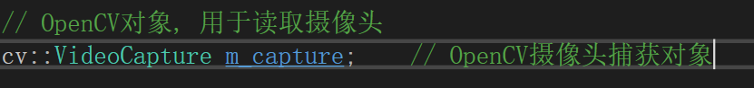

使用 `open(设备索引)`​ 打开对应的摄像头，并设置分辨率（图像中包含的像素数量）：分别设置 `cv::CAP_PROP_FRAME_WIDTH/HEIGHT` 宽高方向的像素个数来实现；

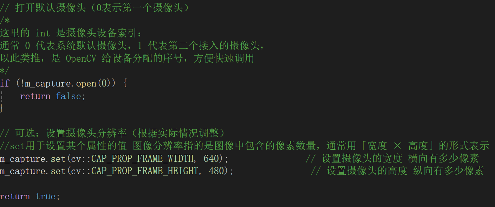

接着创建一个槽函数连接QT定时器的 `timeout()` 信号，接着就可以使用摄像头读取帧并保存在一个矩阵图像 cv::Mat 中；

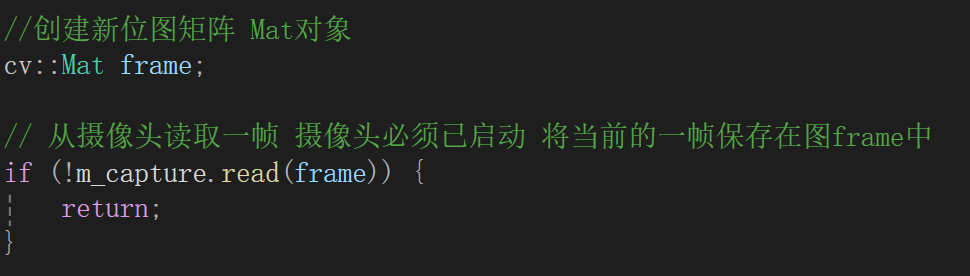

接着就可以在每次的定时器超时信号槽函数中，处理捕获的每一帧。

‍

### 将捕获的帧转换为 QImage :

首先判断捕获的矩阵图像 cv::Mat 的类型，使用 `.type()`​ 返回；若为彩色图，则转化为 RGB 标准彩色图像，使用 `cv::cvtColor()` 转换将结果存放到指定 Mat 矩阵中；

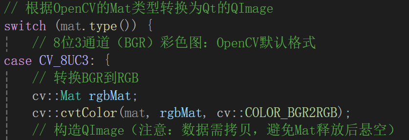

接着构造 QImage 对象拷贝返回；使用上述转换后矩阵的信息构造，注意要传入步长 `rgbMat.step`​ 避免冗余填充字节导致花屏，注意要进行拷贝 `.copy()` 返回副本，避免 rgbMat 超出作用域而被释放导致返回值变空；

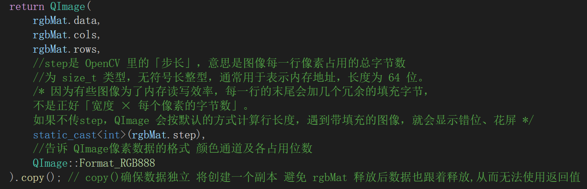

若 Mat 类型为灰度图，则不需要转换颜色空间，直接构造 QImage 即可；

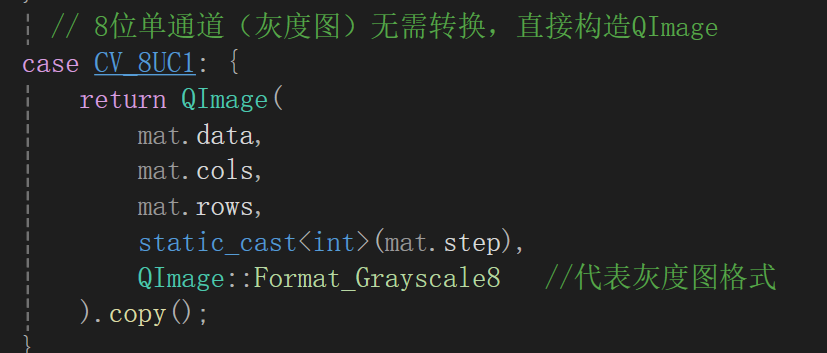

‍

### 识别人脸：

首先要创建 opencv 中加载和使用级联分类器模型的类，Haar 级联分类器对象；

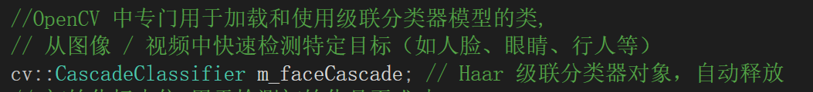

**初始化**：接着要初始化级联分类器：通过快速排除非目标区域实现高效目标检测（如人脸）的传统计算机视觉算法；

加载 opencv 的预编译模型文件 .xml，这是专门识别正脸的模型；

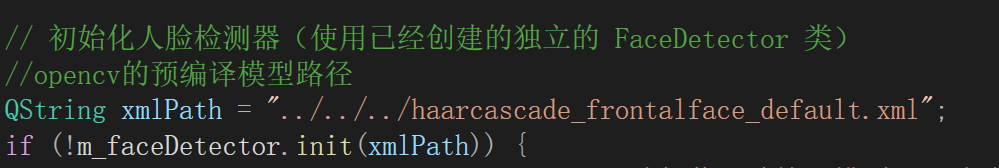

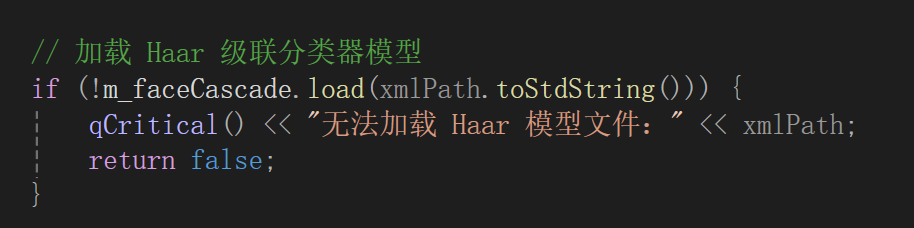

**人脸检测**：然后在摄像头捕获帧矩阵图像后，调用接口先提高检测效率（转换为灰度图，直方图均衡化），最后调用 `CascadeClassifier::detectMultiScale()`方法执行人脸检测，将锥形框列表传入 faces 中；

锥形框列表中存放了当前帧图像中的所有识别到的人脸锥形框；

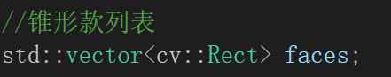

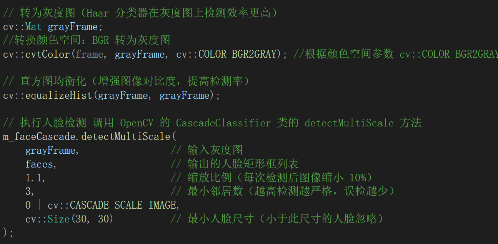

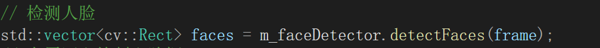

**在帧图像上绘制锥形框**：遍历锥形框列表，使用 `rectangle()` 将 face 绘制到矩阵图 frame 上，并设置锥形颜色 color 和宽度 thickness ；

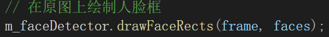

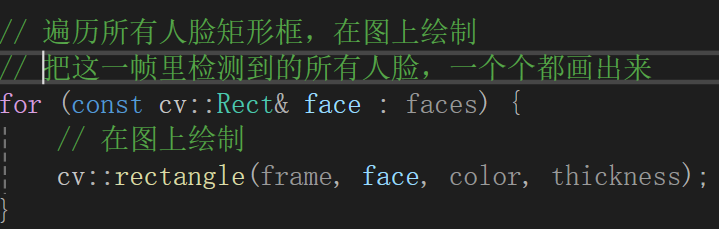

之后就可以将矩阵 frame 经历变换后绘制到屏幕上。

‍

### 将 QImage 显示在屏幕上：

使用 QLabel 来显示图像，因 QImage 是数据处理专用类，QLabel 不提供其的接口，所以要转换为 QPixmap 渲染专用类；使用 `QPixmap::fromImage()` 转换；接着缩放 QPixmap ，设置比例缩放，平滑处理。

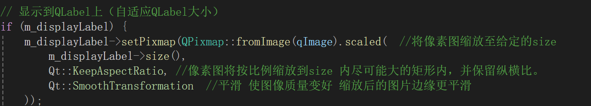

‍

# 项目经验：

### 摄像头设备索引：

opencv 为电脑上的摄像头设备都抽象化设置了设备索引 int，这是跨平台的，在任何系统都可以使用；通常 0 代表系统默认的摄像头设备，1 为第二个外接摄像头，...... 以此类推；

使用 `open(设备索引)`​ 可以打开某个摄像头设备流，接着就可以从中读取 `read()` 一帧图像处理。

‍

### opencv 的矩阵图类型：

opencv 定义了图像的像素存储格式，决定了图像在内存中的读取、处理规则；使用 `cv::Mat::type()` 来返回其使用的类型；

命名规则：`CV_【比特位】【数据类型】【通道数】`

- <span data-type="text" style="color: var(--b3-font-color2);">比特位</span>：**图像能使用多少种颜色深浅**；单通道像素占用的比特数，常用 <span data-type="text" style="color: var(--b3-font-color3);">8</span>（8bit=1 字节，对应 0-255 的亮度范围）；

- <span data-type="text" style="color: var(--b3-font-color2);">数据类型</span>：<span data-type="text" style="color: var(--b3-font-color3);">U</span>= 无符号整数（普通图像通用）、<span data-type="text" style="color: var(--b3-font-color3);">S</span>= 有符号整数（能表示负数）、<span data-type="text" style="color: var(--b3-font-color3);">F</span>= 浮点数（高精度计算用）；

- <span data-type="text" style="color: var(--b3-font-color2);">通道数</span>：**图像使用多少种颜色渲染**；<span data-type="text" style="color: var(--b3-font-color3);">C1</span>= 单通道灰度图、<span data-type="text" style="color: var(--b3-font-color3);">C3</span>=3 通道 BGR 彩色图（OpenCV 默认格式）、<span data-type="text" style="color: var(--b3-font-color3);">C4</span>=4 通道带透明通道的图像 ；

最常用类型：`CV_8UC3` 为 8 位无符号 3 通道 BGR 彩色图像，适配普通摄像头、彩色图片的默认格式。

‍

### 颜色通道的顺序类型：

opencv 和 现在的通用标准（Qt 的QImage、电脑显示器、普通 jpg/png 图片、网页等）使用的颜色通道类型不同，颜色通道即<span data-type="text" style="color: var(--b3-font-color2);">彩色图像中蓝（Blue）、绿（Green）、红（Red）三种颜色通道的排列顺序</span>；先存储蓝，接着绿，最后红

- **OpenCV 用 BGR**：

  这是历史遗留问题 ——OpenCV 早期开发时，当时的摄像头、显卡硬件普遍用 BGR 顺序，所以 OpenCV 就把 BGR 设为了默认格式（比如你用VideoCapture读摄像头，出来的图像就是 BGR 的）
- **Qt / 显示器 / 图片用 RGB**：

  现在的通用标准（Qt 的QImage、电脑显示器、普通 jpg/png 图片、网页等）都用 RGB 顺序，因为人眼对绿色更敏感，RGB 的排列在这些场景下显示效率更高、颜色更准

使用opencv的 `cv::cvtColor(mat, rgbMat, cv::COLOR_BGR2RGB)` 将 BGR矩阵图 mat 转化为 RGB格式，存入 rgbMat 中；

‍

### cv::Mat 与 Qt QPixmap 的转换：

cv::Mat 无法直接与 Qt QPixmap 转换，必须先转换为 QImage ，而<span data-type="text" style="color: var(--b3-font-color2);"> QPixmap 仅能从 QImage 转换而来</span>。

|图像类|所属库|核心职责|能否直接互转|
| --------| --------| -------------------------------------| ---------------------------------|
|​`cv::Mat`|OpenCV|像素级图像处理、算法运算|❌ 无法直接转 QPixmap|
|​`QImage`|Qt|像素级读写、格式转换（如 BGR→RGB）|✅ 是 Mat 和 QPixmap 的「桥梁」|
|​`QPixmap`|Qt|针对**屏幕显示优化**的图像类，渲染效率高|✅ 只能从 QImage 转换而来|

- opencv 拍摄的图像 cv::Mat 经过 RGB 转换后可以被 QImage 构造函数读取，从而创建 QImage 对象。

‍

### QLabel 仅能显示 QPixmap ：

**QImage** 是 “内存里的像素数组”，<span data-type="text" style="color: var(--b3-font-color2);">侧重数据处理</span>（比如修改某个像素的颜色、裁剪图像）；

**QPixmap** 是 “适配屏幕的绘图资源”，<span data-type="text" style="color: var(--b3-font-color2);">侧重高效显示</span>（Qt 会把它缓存到显卡，渲染到屏幕时速度极快）；

而 QLabel 底层渲染逻辑只对接 QPixmap（因为 QPixmap 是为屏幕显示优化的），所以不提供对于 QImage 的接口，仅提供 QPixmap 的接口。

‍

### 图像识别前的准备：

图像识别前可以将矩阵进行预处理，计算机识别时不需要颜色，而且对比度要突出：

- **BGR 彩色图转灰度图：**​<span data-type="text" style="color: var(--b3-font-color2);">去除颜色冗余</span>，提升检测效率，识别中颜色多余；
- **直方图均衡化：** 简而言之就是<span data-type="text" style="color: var(--b3-font-color2);">增强图像对比度</span>，突出人脸特征，提升检出率；

‍

### 人脸检测逻辑：

使用 opencv 基于预训练的 Haar 人脸特征库 `"\haarcascade_frontalface_default.xml"`，里面记了人脸的通用特征：比如眼睛比鼻梁暗、额头

比眼睛亮、嘴巴比周围暗等等，匹配图像中符合人脸明暗、轮廓特征的区域；

使用 opencv 的 `CascadeClassifier::detectMultiScale()` 接口进行级联分类器的识别操作；

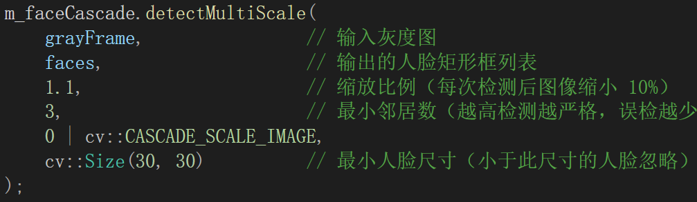

- 多尺度适配：设置 1.1 缩放比例，<span data-type="text" style="color: var(--b3-font-color2);">每次缩小 10% 图像重复检测，适配不同大小的人脸</span>

- 误检过滤：设置最小邻居数 3，仅当<span data-type="text" style="color: var(--b3-font-color2);">同一位置被多次判定为人脸时才确认有效</span>，减少误判

- 范围过滤：设置<span data-type="text" style="color: var(--b3-font-color2);">最小人脸尺寸 30×30，忽略过小区域</span>，提升检测速度

- 结果输出：将有效人脸的矩形坐标存入 faces 容器，完成检测
